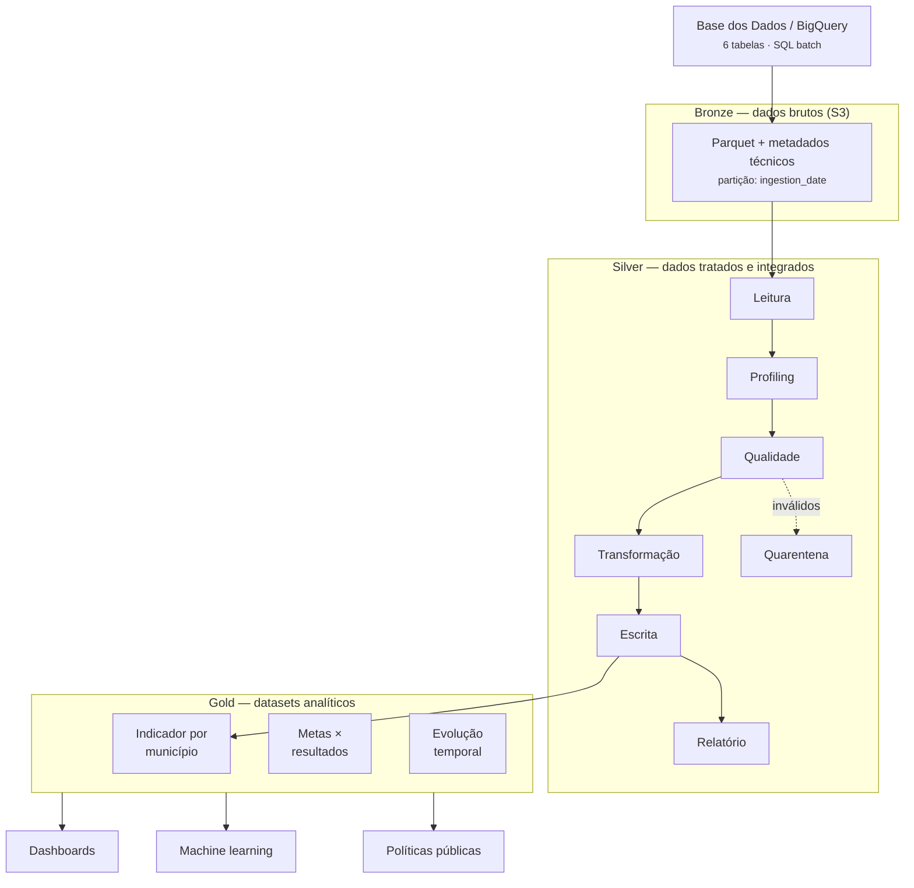

# Tech Challenge Fase 2 - Pipeline de Dados para Avaliação da Alfabetização no Brasil

## Objetivo

Construir uma plataforma de dados para análise exploratória dos dados de alfabetização do Brasil utilizando arquitetura Lakehouse na AWS.

O projeto contempla:

- Ingestão Batch de dados públicos da Base dos Dados (BigQuery)
- Armazenamento em Data Lake (Amazon S3)
- Tratamento em arquitetura medalhão (Bronze, Silver e Gold)
- Streaming de dados utilizando Apache Kafka
- Disponibilização dos dados para análise exploratória e tomada de decisão

---

## Dataset

Fonte:

https://basedosdados.org/dataset/073a39d4-89cf-4068-b1e8-34ed0d9c0b72

Base:

Avaliação da Alfabetização - INEP

Tabelas utilizadas:

- alunos
- municipio
- uf
- meta_alfabetizacao_municipio
- meta_alfabetizacao_uf
- meta_alfabetizacao_brasil

---

## Arquitetura

Diagrama detalhado da pipeline (também em [docs/arquitetura.md](docs/arquitetura.md)):



Fluxo resumido: Base dos Dados → BigQuery → Python → Amazon S3 (Bronze) →
Silver (profiling + qualidade + padronização + integração) → Gold (datasets
analíticos) → análise exploratória, dashboards e IA.

---

## Estrutura do Projeto

```text
tech-challenge-fase2/
│
├── src/
│   ├── common/     # config, logger e I/O de S3 compartilhados (Silver/Gold)
│   ├── bronze/     # ingestão dos dados brutos (Base dos Dados -> S3)
│   ├── silver/     # limpeza, qualidade, padronização e integração
│   ├── gold/       # datasets analíticos
│   └── streaming/  # ingestão em streaming (fase futura)
│
├── tests/          # testes de lógica (Silver/Gold) com dados sintéticos
├── reports/        # cópia local dos relatórios de qualidade
├── docs/           # documentação técnica e catálogo de dados
├── infra/
├── notebooks/
├── tmp/
│
├── .env
├── .gitignore
├── requirements.txt
└── README.md
```

---

## Tecnologias Utilizadas

- Python 3.13
- Pandas
- PyArrow
- Base dos Dados
- BigQuery
- Amazon S3
- Apache Kafka
- Git
- GitHub

---

## Decisões Técnicas

### Amazon S3

Escolhido por possuir:

- alta durabilidade
- baixo custo
- escalabilidade praticamente ilimitada
- integração nativa com Glue e Athena

---

### Formato Parquet

Escolhido por:

- armazenamento colunar
- menor espaço em disco
- consultas mais rápidas
- menor custo em motores analíticos

---

### Ingestão via Base dos Dados + BigQuery

Escolhido por:

- evitar extrações manuais em CSV
- processo reproduzível
- pipeline automatizável
- arquitetura mais próxima de ambientes corporativos

---

### Arquitetura Modular

O projeto foi dividido em módulos:

- config
- queries
- extract
- upload
- pipeline

Objetivos:

- separação de responsabilidades
- menor acoplamento
- maior manutenibilidade
- facilidade para testes e trabalho em equipe

---

## Metadados de Ingestão

As tabelas Bronze recebem os seguintes metadados:

- _ingestion_ts
- _source
- _table

Objetivos:

- rastreabilidade
- auditoria
- governança de dados
- reprocessamento

---

## Camada Silver

A camada Silver transforma os dados brutos da Bronze em dados **limpos,
padronizados, validados e integrados**. O detalhamento está em
[docs/camadas_silver_gold.md](docs/camadas_silver_gold.md).

Fluxo por tabela: leitura da Bronze → *data profiling* → regras de qualidade
(separando válidos de inválidos) → transformações → gravação em `silver/` +
relatório de qualidade em `quality/`.

Tabelas Silver: `alunos`, `alfabetizacao_municipio`, `alfabetizacao_uf` e
`metas` (consolidação de `meta_brasil`, `meta_uf` e `meta_municipio` em formato
analítico longo).

Regras de qualidade: `ano` obrigatório, `taxa_alfabetizacao` entre 0 e 100,
`proficiencia` não negativa, `sigla_uf` com 2 caracteres, `id_municipio` no
formato IBGE, checagem de duplicidade de chave e completude dos campos críticos.
Registros reprovados vão para a **quarentena** em `quality/`.

---

## Camada Gold

A camada Gold disponibiliza **datasets analíticos** prontos para dashboards,
estatística e machine learning:

- `indicador_alfabetizacao_municipio` — indicador por município/rede/série.
- `comparativo_metas_resultados` — taxa realizada vs. meta (`gap_para_meta`,
  `atingiu_meta`).
- `evolucao_temporal_indicador` — evolução da taxa por localidade ao longo do tempo.

---

## Como Executar

Pré-requisitos: `.env` configurado (credenciais AWS + `S3_BUCKET_NAME`) e a
Bronze já ingerida no S3.

```bash
python -m src.bronze.pipeline    # Ingestão Bronze
python -m src.silver.pipeline    # Tratamento e qualidade (Silver)
python -m src.gold.pipeline      # Datasets analíticos (Gold)
python -m tests.test_silver_gold # Testes de lógica (sem AWS)
```

---

## FinOps — Otimização de Custos

Detalhes em [docs/finops.md](docs/finops.md). Principais decisões que reduzem
custo operacional:

- **Parquet + compressão** e **particionamento por data**, permitindo
  *partition pruning* e reduzindo o volume escaneado por consulta.
- **Arquitetura serverless** (S3 + Athena sugerido), sem cluster persistente:
  custo proporcional ao uso.
- **Leitura apenas da partição mais recente** e **quarentena única** na Silver,
  evitando reprocessamento.
- Recomendação de **S3 Lifecycle Policies** para arquivar partições Bronze
  antigas em classes mais baratas.

---

## Monitoramento

Observabilidade básica via `src/common/logger.py`: cada etapa registra início,
fim, volume processado e falhas. As pipelines consolidam tabelas com sucesso e
com erro e falham explicitamente (`RuntimeError`) quando há tabelas com falha,
facilitando alertas. Os relatórios de qualidade (contagens de válidos/inválidos,
falhas por regra e completude) ficam em `quality/` no S3 e em `reports/`
localmente.

---

## Aplicação em IA

A camada Gold foi desenhada para viabilizar:

- **Modelos de predição de alfabetização** por município (regressão da
  `taxa_alfabetizacao` a partir de variáveis territoriais e socioeconômicas).
- **Análise de desigualdade educacional** e **clusters de vulnerabilidade**
  (agrupamento de municípios por desempenho e distância até a meta).
- **Políticas públicas baseadas em dados**, priorizando localidades com maior
  `gap_para_meta` no comparativo metas × resultados.

A estrutura permite enriquecimento futuro com fontes externas (Censo Escolar,
IBGE/PNAD, FUNDEB) para ampliar o poder preditivo.

---

## Status do Projeto

✅ Fase 1 - Setup e Ingestão Bronze concluída

✅ Fase 2 - Camada Silver (profiling, qualidade, padronização e integração)

✅ Fase 3 - Camada Gold (datasets analíticos)

⬜ Fase 4 - Streaming Kafka

⬜ Fase 5 - Análise Exploratória e Apresentação