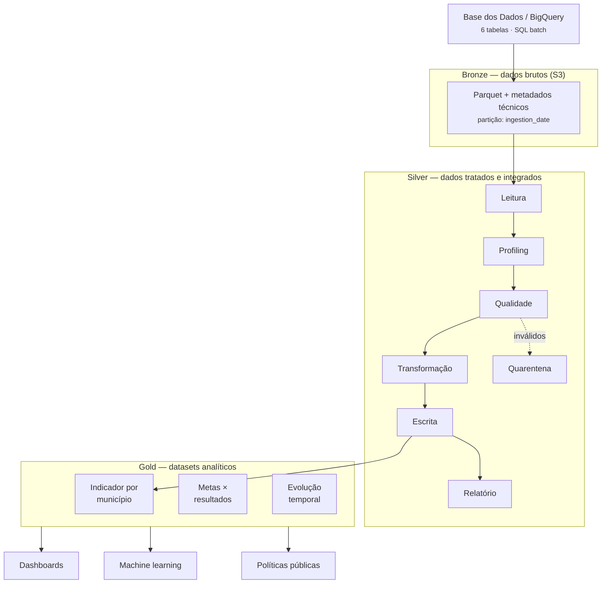

# Tech Challenge Fase 2 - Pipeline de Dados para Avaliação da Alfabetização no Brasil

## Objetivo

Construir uma plataforma de dados para análise exploratória dos dados de alfabetização do Brasil utilizando arquitetura Lakehouse na AWS.

O projeto contempla:

- Ingestão Batch de dados públicos da Base dos Dados (BigQuery)
- Armazenamento em Data Lake (Amazon S3)
- Tratamento em arquitetura medalhão (Bronze, Silver e Gold)
- Streaming de dados utilizando Apache Kafka
- Disponibilização dos dados para análise exploratória e tomada de decisão

---

## Dataset

Fonte:

https://basedosdados.org/dataset/073a39d4-89cf-4068-b1e8-34ed0d9c0b72

Base:

Avaliação da Alfabetização - INEP

Tabelas utilizadas:

- alunos
- municipio
- uf
- meta_alfabetizacao_municipio
- meta_alfabetizacao_uf
- meta_alfabetizacao_brasil

---

## Arquitetura

Diagrama detalhado da pipeline (também em [docs/arquitetura.md](docs/arquitetura.md)):


```mermaid
flowchart TD
    A["Base dos Dados / BigQuery<br/><small>6 tabelas · SQL batch</small>"] --> B

    subgraph BRONZE["Bronze — dados brutos (S3)"]
        B["Parquet + metadados técnicos<br/><small>partição: ingestion_date</small>"]
    end

    B --> S1

    subgraph SILVER["Silver — dados tratados e integrados"]
        direction LR
        S1["Leitura"] --> S2["Profiling"]
        S2 --> S3["Qualidade"]
        S3 --> S4["Transformação"]
        S4 --> S5["Escrita"]
        S3 -. inválidos .-> Q["Quarentena"]
        S5 --> R["Relatório"]
    end

    S5 --> G1

    subgraph GOLD["Gold — datasets analíticos"]
        direction LR
        G1["Indicador por<br/>município"]
        G2["Metas ×<br/>resultados"]
        G3["Evolução<br/>temporal"]
    end

    GOLD --> C1["Dashboards"]
    GOLD --> C2["Machine learning"]
    GOLD --> C3["Políticas públicas"]
```

Fluxo resumido: Base dos Dados → BigQuery → Python → Amazon S3 (Bronze) →
Silver (profiling + qualidade + padronização + integração) → Gold (datasets
analíticos) → análise exploratória, dashboards e IA.

---

## Estrutura do Projeto

```text
tech-challenge-fase2/
│
├── src/
│   ├── common/     # logger e utilitários compartilhados
│   ├── bronze/     # ingestão dos dados brutos (Base dos Dados -> S3)
│   ├── silver/     # limpeza, qualidade, padronização e integração (orientada por metadados)
│   ├── gold/       # datasets analíticos
│   └── streaming/  # ingestão em streaming (Kafka)
│
├── tests/          # testes de lógica com dados sintéticos
├── reports/        # cópia local dos relatórios de qualidade
├── docs/           # documentação técnica e catálogo de dados
├── notebooks/
├── tmp/
│
├── .env
├── .gitignore
├── .python-version
├── requirements.txt
└── README.md
```

---

## Tecnologias Utilizadas

- Python
- Pandas
- PyArrow
- Boto3
- Base dos Dados
- Google BigQuery
- Amazon S3
- Apache Kafka
- Git
- GitHub

---

# Configuração do Ambiente

## Pré-requisitos

- Git
- Python (versão definida em `.python-version`)

## Clonar o repositório

```bash
git clone <URL_DO_REPOSITORIO>
cd tech-challenge-fase2
```

## Criar o ambiente virtual

```bash
python -m venv .venv
```

## Ativar o ambiente virtual

### Windows

```bash
.venv\Scripts\activate
```

### Linux / macOS

```bash
source .venv/bin/activate
```

## Instalar as dependências

```bash
pip install -r requirements.txt
```

## Verificar a instalação

```bash
python --version
pip list
```

---

## Decisões Técnicas

### Amazon S3

Escolhido por possuir:

- alta durabilidade
- baixo custo
- escalabilidade praticamente ilimitada
- integração nativa com Glue e Athena

---

### Formato Parquet

Escolhido por:

- armazenamento colunar
- menor espaço em disco
- consultas mais rápidas
- menor custo em motores analíticos

---

### Ingestão via Base dos Dados + BigQuery

Escolhido por:

- evitar extrações manuais em CSV
- processo reproduzível
- pipeline automatizável
- arquitetura mais próxima de ambientes corporativos

---

### Arquitetura Modular

O projeto foi dividido em módulos:

- config
- queries
- extract
- upload
- pipeline

Objetivos:

- separação de responsabilidades
- menor acoplamento
- maior manutenibilidade
- facilidade para testes e trabalho em equipe

---

### Camada Silver orientada por metadados

A camada Silver utiliza um catálogo centralizado localizado em `src/silver/catalog.py`.

Esse catálogo concentra as regras de negócio de cada tabela, incluindo:

- descrição;
- chave natural;
- colunas obrigatórias;
- regras de validação;
- colunas categóricas.

O pipeline utiliza essas informações para executar automaticamente as validações e transformações da camada Silver, reduzindo duplicação de código, facilitando manutenção e simplificando a inclusão de novas tabelas.

---

## Metadados de Ingestão

As tabelas Bronze recebem os seguintes metadados:

- `_ingestion_ts`
- `_source`
- `_table`

Objetivos:

- rastreabilidade
- auditoria
- governança de dados
- reprocessamento

---

## Camada Silver

A camada Silver transforma os dados brutos da Bronze em dados **limpos,
padronizados, validados e integrados**, de forma **orientada por metadados**:
as regras de cada tabela (chave natural, colunas obrigatórias, validações e
colunas categóricas) ficam centralizadas em `src/silver/catalog.py` e o
pipeline as aplica automaticamente. O detalhamento está em
[docs/silver_rules.md](docs/silver_rules.md).

Fluxo por tabela: leitura da Bronze → *data profiling* → regras de qualidade →
transformações → integração relacional (`src/silver/integration.py`) →
gravação em `silver/` + relatórios de qualidade e de relacionamento.

---

## Camada Gold

A camada Gold disponibiliza **datasets analíticos** prontos para dashboards,
estatística e machine learning:

- `indicador_alfabetizacao_municipio` — indicador por município/rede/série.
- `comparativo_metas_resultados` — taxa realizada vs. meta (`gap_para_meta`,
  `atingiu_meta`).
- `evolucao_temporal_indicador` — evolução da taxa por localidade ao longo do tempo.

---

## Como Executar

Pré-requisitos: `.env` configurado (credenciais AWS + `S3_BUCKET_NAME`) e a
Bronze já ingerida no S3.

```bash
python -m src.bronze.pipeline    # Ingestão Bronze
python -m src.silver.pipeline    # Tratamento e qualidade (Silver)
python -m src.gold.pipeline      # Datasets analíticos (Gold)
python -m tests.test_silver_gold # Testes de lógica (sem AWS)
```

---

## FinOps — Otimização de Custos

Detalhes em [docs/finops.md](docs/finops.md). Principais decisões que reduzem
custo operacional:

- **Parquet + compressão** e **particionamento por data**, permitindo
  *partition pruning* e reduzindo o volume escaneado por consulta.
- **Arquitetura serverless** (S3 + Athena sugerido), sem cluster persistente:
  custo proporcional ao uso.
- **Leitura apenas da partição mais recente** e **quarentena única** na Silver,
  evitando reprocessamento.
- Recomendação de **S3 Lifecycle Policies** para arquivar partições Bronze
  antigas em classes mais baratas.

---

## Monitoramento

Observabilidade básica via `src/common/logger.py`: cada etapa registra início,
fim, volume processado e falhas. As pipelines consolidam tabelas com sucesso e
com erro e falham explicitamente (`RuntimeError`) quando há tabelas com falha,
facilitando alertas. Os relatórios de qualidade (contagens de válidos/inválidos,
falhas por regra e completude) ficam em `quality/` no S3 e em `reports/`
localmente.

---

## Aplicação em IA

A camada Gold foi desenhada para viabilizar:

- **Modelos de predição de alfabetização** por município (regressão da
  `taxa_alfabetizacao` a partir de variáveis territoriais e socioeconômicas).
- **Análise de desigualdade educacional** e **clusters de vulnerabilidade**
  (agrupamento de municípios por desempenho e distância até a meta).
- **Políticas públicas baseadas em dados**, priorizando localidades com maior
  `gap_para_meta` no comparativo metas × resultados.

A estrutura permite enriquecimento futuro com fontes externas (Censo Escolar,
IBGE/PNAD, FUNDEB) para ampliar o poder preditivo.

---

# Como Contribuir

Para manter a organização do projeto, todas as alterações devem seguir o fluxo de versionamento abaixo.

## 1. Clonar o repositório

```bash
git clone <URL_DO_REPOSITORIO>
cd tech-challenge-fase2
```

## 2. Atualizar a branch develop

```bash
git checkout develop
git pull
```

## 3. Criar uma branch de desenvolvimento

Utilize o padrão:

```text
feature/nome-da-feature
```

Exemplo:

```bash
git checkout -b feature/silver-layer
```

## 4. Desenvolver a funcionalidade

Implemente e teste sua alteração localmente.

## 5. Registrar as alterações

```bash
git add .
git commit -m "feat: implementação da camada Silver"
```

## 6. Enviar para o GitHub

```bash
git push -u origin feature/silver-layer
```

## 7. Abrir um Pull Request

Após concluir a implementação, abra um Pull Request para a branch `develop` para revisão e integração ao projeto.

---

## Status do Projeto

- ✅ Fase 1 - Setup e Ingestão Bronze concluída
- ✅ Fase 2 - Camada Silver (orientada por metadados, qualidade e integração)
- 🔄 Fase 3 - Camada Gold (datasets analíticos)
- 🔄 Fase 4 - Streaming Kafka
- ⬜ Fase 5 - Análise Exploratória e Apresentação
