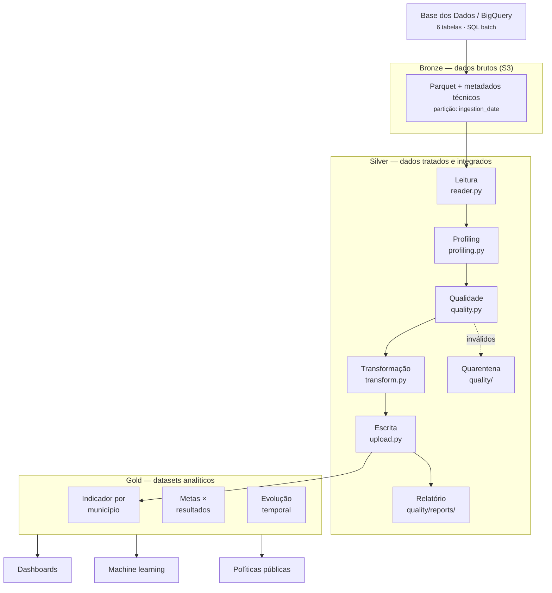

# Arquitetura do Projeto

## Diagrama da pipeline (arquitetura medalhão)



## Fluxo textual

```text
                 Base dos Dados
                         │
                         │ SQL
                         ▼
                    BigQuery
                         │
                         ▼
                    Python ETL
                         │
            ┌────────────┴────────────┐
            │                         │
            ▼                         ▼
        Parquet                 Metadados
            │                         │
            └────────────┬────────────┘
                         │
                         ▼
                    Amazon S3
                  Camada Bronze
                         │
                         ▼
                    Silver Layer
                         │
                         ▼
                     Gold Layer
                         │
                         ▼
                 Exploração de Dados
```